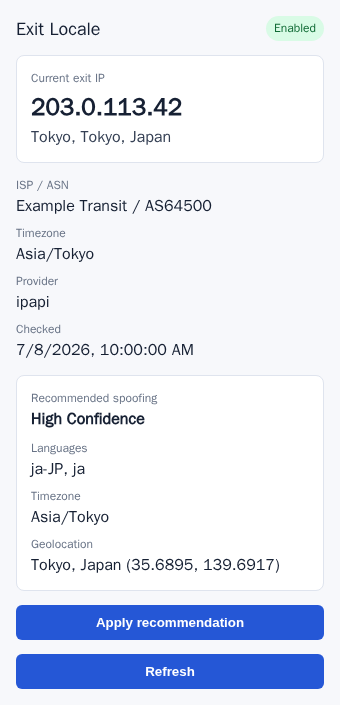
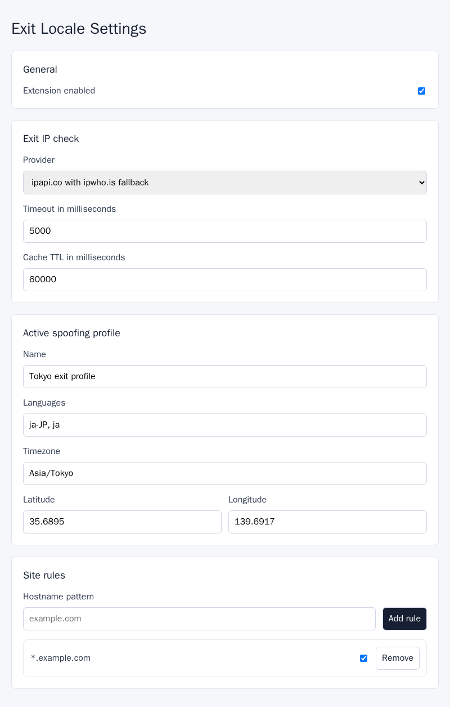

# Exit Locale Browser Plugin

Browser extension for Chrome, Edge, and Firefox that checks the current network exit IP and helps align browser language, timezone, and geolocation signals with that exit location.

## Features

- React popup and options pages
- Background service for privileged extension actions
- Content script scaffold for page-side behavior
- Typed settings, messages, and rule matching
- Current exit IP and geolocation check through a replaceable provider interface
- Recommended language, timezone, and geolocation spoofing settings based on the latest exit IP
- Vitest coverage for core logic

The default exit IP provider contacts `https://ipapi.co/json/` and falls back to `https://ipwho.is/` when the primary provider fails. Those providers can observe the network exit IP used for the request.
The recommendation uses the provider's timezone, languages, latitude, and longitude fields when available, and falls back to country-based language defaults when needed.
See [PRIVACY.md](PRIVACY.md) for the data-use summary.

## Screenshots

| Popup | Options |
| --- | --- |
|  |  |

## Development

Install dependencies:

```bash
pnpm install
```

Start the Chromium development build:

```bash
pnpm dev
```

Start the Firefox development build:

```bash
pnpm dev:firefox
```

## Build

Build Chrome and Edge output:

```bash
pnpm build:chrome
```

Build Firefox output:

```bash
pnpm build:firefox
```

WXT writes browser output under `.output/`.

Build store-ready ZIP files:

```bash
pnpm zip:chrome
pnpm zip:firefox
```

## Release

Publish a version by pushing a `v*` tag:

```bash
git tag v0.1.0
git push origin v0.1.0
```

The release workflow builds Chrome and Firefox extension ZIP packages, creates source archives (`.tar.gz` and `.zip`), uploads them as workflow artifacts, and attaches them to a GitHub Release.

You can also run the `Release Packages` workflow manually from GitHub Actions. Provide an existing `v*` tag, or leave the tag input empty to use the `package.json` version.

## Tests

Run unit tests:

```bash
pnpm test
```

Run TypeScript checks:

```bash
pnpm typecheck
```

Run the Chromium extension smoke test:

```bash
pnpm e2e:smoke
```

The smoke test uses Playwright's bundled Chromium and loads `.output/chrome-mv3` as an unpacked extension. On a fresh machine, install the browser runtime once:

```bash
pnpm exec playwright install chromium
pnpm exec playwright install-deps chromium
```

## Loading The Extension

Chrome or Edge:

1. Open `chrome://extensions` or `edge://extensions`.
2. Enable developer mode.
3. Load the `.output/chrome-mv3` unpacked extension directory.

Firefox:

1. Open `about:debugging#/runtime/this-firefox`.
2. Click "Load Temporary Add-on".
3. Select the manifest file inside the Firefox output directory.
